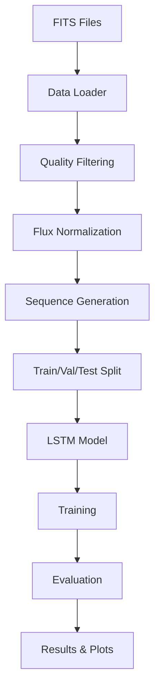

# LSTM Exoplanet Classification System

This directory contains a complete deep learning pipeline for classifying Kepler light curves to detect exoplanets using LSTM neural networks.

## 📁 Directory Structure

```
ann/
├── data_loader.py           # FITS file loading and processing
├── preprocessing.py         # Data cleaning and sequence generation  
├── lstm_model.py           # LSTM model architecture
├── utils.py                # Evaluation metrics and plotting
├── exoplanet_classifier.py # Main training script
├── test_pipeline.py        # Pipeline testing script
├── test_config.json        # Configuration for testing
└── README.md              # This file
```

## 🎯 Objective

Create an LSTM model that analyzes Kepler light curves to classify objects as confirmed exoplanets (Y=1) or non-exoplanets (Y=0).

## 📊 Data Structure Expected

The pipeline expects data in the following directory structure (relative to this folder):

```
../data/
├── Kepler_confirmed_wget/     # Confirmed exoplanets (Y=1)
│   └── *.fits files
├── Kepler_KOI_wget/          # KOI candidates (Y=0)  
│   └── *.fits files
└── Kepler_Quarterly_wget/    # Additional candidates (Y=0)
    └── *.fits files
```

## 🚀 Quick Start

### 1. Install Dependencies

```bash
# Install the required packages
pip install -r ../requirements.txt
```

The key dependencies include:
- `astropy` - For reading FITS files
- `tensorflow` - For LSTM model training
- `scikit-learn` - For evaluation metrics
- `matplotlib`, `seaborn` - For plotting
- `numpy`, `pandas` - For data processing

### 2. Test the Pipeline

Before running the full training, test the pipeline components:

```bash
python test_pipeline.py
```

This will test:
- FITS file loading
- Data preprocessing
- Utility functions

### 3. Run Full Training

#### Simple Training
```bash
python exoplanet_classifier.py
```

#### With Configuration File
```bash
python exoplanet_classifier.py --config test_config.json
```

#### With Command Line Arguments
```bash
python exoplanet_classifier.py --epochs 50 --batch-size 64 --model-type advanced
```

## 🔧 Configuration

The system can be configured via JSON files or command line arguments:

### Configuration Parameters

| Parameter | Default | Description |
|-----------|---------|-------------|
| `data_root` | `../data` | Root directory for FITS files |
| `sequence_length` | 1000 | Fixed length for LSTM sequences |
| `stride_ratio` | 0.5 | Overlap ratio for sequence generation |
| `epochs` | 100 | Number of training epochs |
| `batch_size` | 32 | Training batch size |
| `model_type` | `simple` | Model architecture (`simple` or `advanced`) |
| `lstm_units` | 64 | Number of LSTM units |
| `learning_rate` | 0.001 | Learning rate for optimizer |

### Example Configuration (test_config.json)

```json
{
  "sequence_length": 1000,
  "epochs": 50,
  "batch_size": 32,
  "model_type": "simple",
  "lstm_units": 64,
  "dropout_rate": 0.3
}
```

## 🏗️ Pipeline Architecture

### 1. Data Loading (`data_loader.py`)
- Reads FITS files recursively from specified directories
- Extracts key columns: `time`, `pdcsap_flux`, `pdcsap_flux_err`, `quality`
- Assigns labels based on directory (confirmed=1, others=0)
- Extracts KIC IDs from filenames

### 2. Data Preprocessing (`preprocessing.py`)
- **Quality Filtering**: Removes data points where `quality > 0`
- **NaN Removal**: Removes invalid flux measurements
- **Flux Normalization**: Z-score normalization per light curve:
  ```
  Flux_norm = (Flux - median(Flux)) / std(Flux)
  ```
- **Sequence Generation**: Creates fixed-length sequences (L=1000) with overlapping windows
- **Train/Val/Test Split**: Ensures no data leakage by splitting on KIC IDs

### 3. Model Architecture (`lstm_model.py`)
- **Input**: (sequence_length=1000, n_features=2)
- **LSTM Layer**: 64 units with dropout (0.3)
- **Dense Layer**: 32 units with ReLU activation
- **Output**: Single sigmoid unit for binary classification
- **Advanced Option**: Bidirectional LSTM with multiple layers

### 4. Training & Evaluation (`exoplanet_classifier.py`)
- **Optimizer**: Adam with learning rate 0.001
- **Loss**: Binary crossentropy with class weighting
- **Callbacks**: Early stopping, learning rate reduction
- **Metrics**: Accuracy, Precision, Recall, F1-score, ROC-AUC
- **Threshold Optimization**: Finds optimal classification threshold

### 5. Visualization & Utils (`utils.py`)
- Training history plots
- Confusion matrices
- ROC and Precision-Recall curves
- Comprehensive evaluation reports
- Model performance summaries

## 📈 Expected Outputs

After training, the system generates:

1. **Model Files**:
   - `exoplanet_lstm_model.h5` - Trained model
   - `best_exoplanet_model.h5` - Best weights during training

2. **Evaluation Results**:
   - `evaluation_results.json` - Detailed metrics
   - `summary_report.txt` - Human-readable summary

3. **Visualizations**:
   - `training_history.png` - Loss and accuracy curves
   - `confusion_matrix.png` - Classification results
   - `roc_curve.png` - ROC analysis
   - `precision_recall_curve.png` - PR analysis

4. **Configuration**:
   - `config.json` - Used configuration parameters

## 🎛️ Model Types

### Simple Model
- Single LSTM layer (64 units)
- Single dense layer (32 units)
- Dropout regularization
- ~50K parameters

### Advanced Model  
- Bidirectional LSTM layers
- Multiple LSTM layers (128 → 64 units)
- Higher capacity dense layers
- ~200K parameters

## 📊 Performance Metrics

The system evaluates models using:

- **Accuracy**: Overall correctness
- **Precision**: True positive rate
- **Recall**: Sensitivity to exoplanets
- **F1-Score**: Harmonic mean of precision/recall
- **ROC-AUC**: Area under ROC curve
- **Specificity**: True negative rate
- **Balanced Accuracy**: Average of sensitivity/specificity

## 🔍 Data Flow



## 🛠️ Troubleshooting

### Common Issues

1. **No FITS files found**:
   - Check data directory structure
   - Ensure FITS files are in correct subdirectories

2. **TensorFlow import errors**:
   - Install TensorFlow: `pip install tensorflow`
   - Check Python version compatibility

3. **Memory errors during training**:
   - Reduce `batch_size` in configuration
   - Reduce `sequence_length` if needed

4. **Poor model performance**:
   - Increase `epochs` for longer training
   - Try `advanced` model type
   - Adjust `learning_rate`

### Performance Tips

- Use GPU if available for faster training
- Increase `batch_size` if you have sufficient memory
- Use `advanced` model for better performance (requires more data)
- Monitor validation loss to prevent overfitting

## 📚 Key Features

✅ **Complete Pipeline**: End-to-end solution from FITS files to trained model  
✅ **Data Quality**: Robust preprocessing with quality filtering and normalization  
✅ **No Data Leakage**: Proper train/test splitting by KIC ID  
✅ **Class Imbalance Handling**: Automatic class weighting  
✅ **Comprehensive Evaluation**: Multiple metrics and visualizations  
✅ **Configurable**: Flexible hyperparameter configuration  
✅ **Production Ready**: Proper logging, error handling, and documentation  

## 🔬 Research Notes

This implementation follows best practices for time series classification:

- **Temporal Consistency**: Maintains time-ordered sequences
- **Feature Engineering**: Uses both flux and flux error as features
- **Regularization**: Dropout and early stopping prevent overfitting
- **Evaluation**: Proper cross-validation methodology
- **Reproducibility**: Fixed random seeds and saved configurations

## 📞 Support

For issues or questions:
1. Check the troubleshooting section above
2. Review the test output from `test_pipeline.py`
3. Examine the generated log files for detailed error messages
4. Verify FITS file format and directory structure

---

**Happy exoplanet hunting! 🌟🪐**